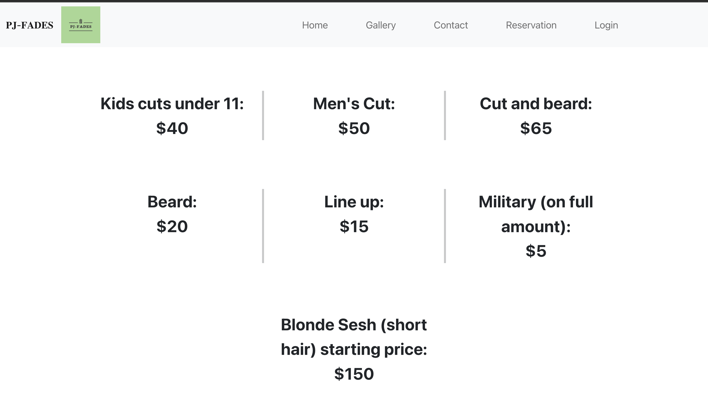
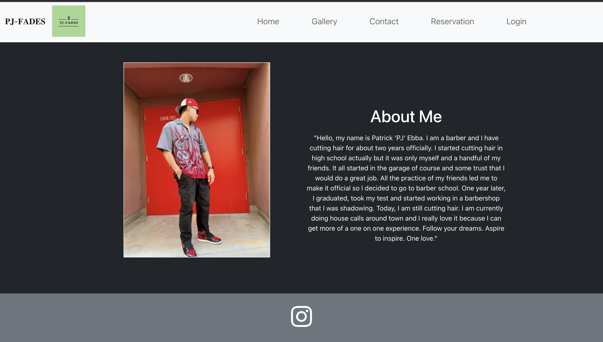
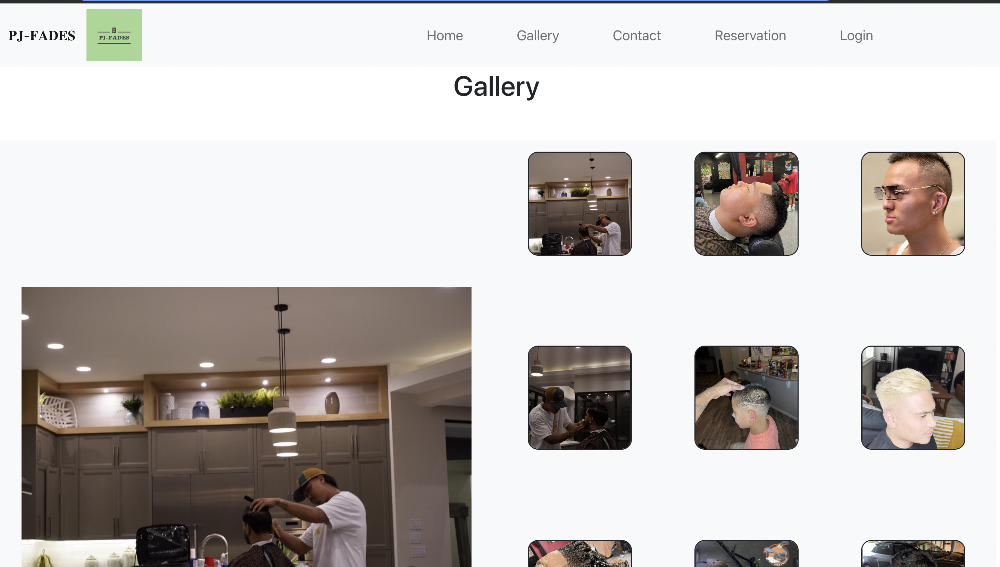
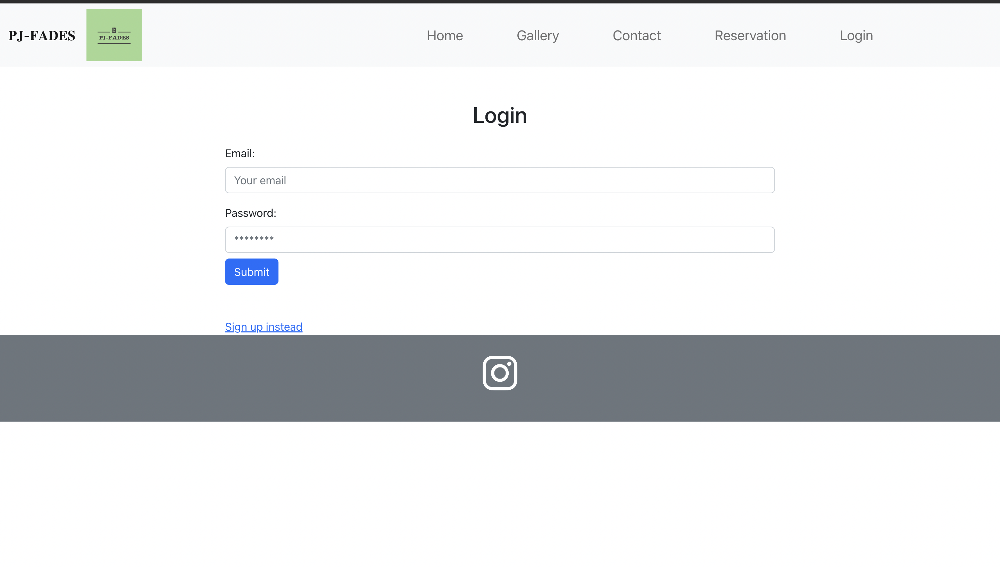
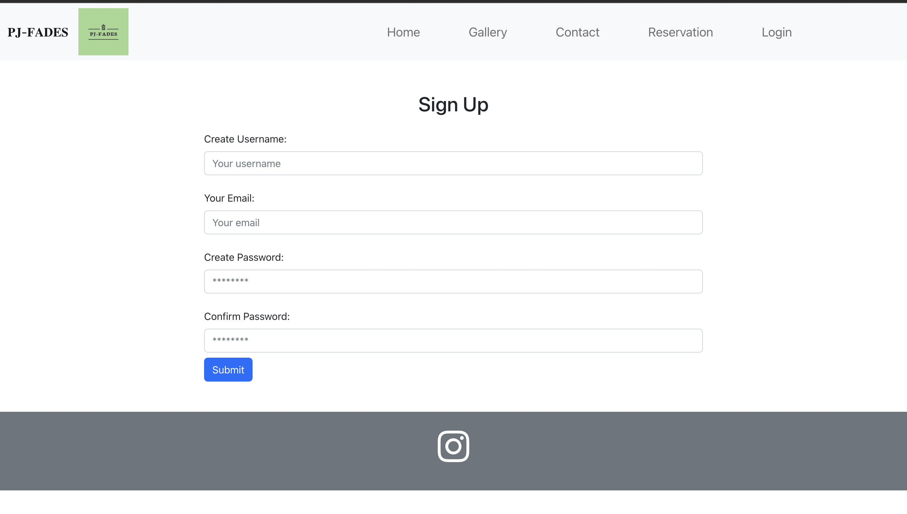
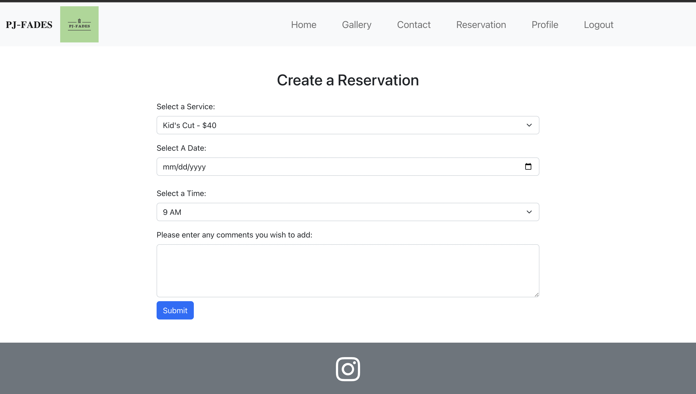
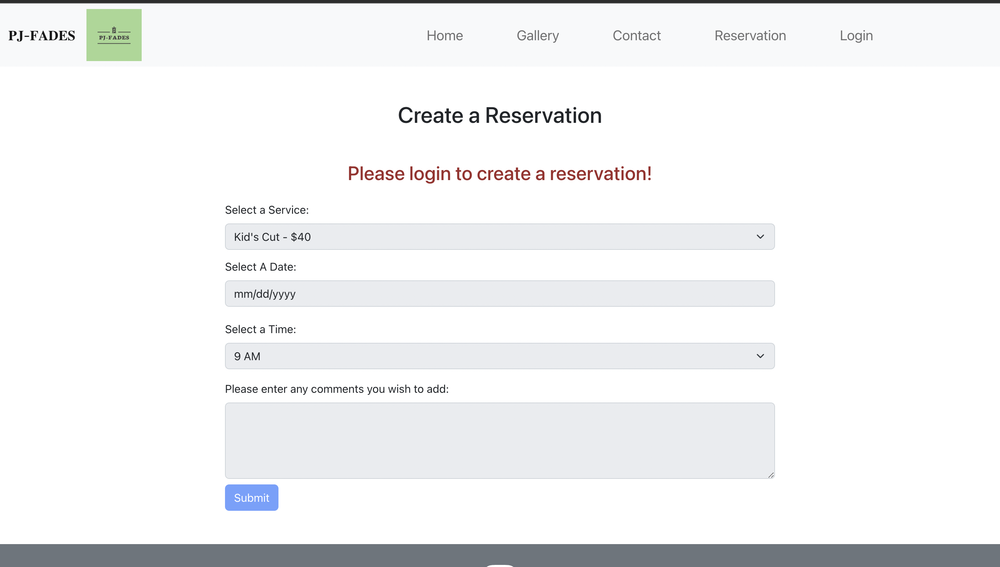

# PJ Fades

## Table of Contents
[Description](#description) <br />
[Deployed Application](#deployed) <br/>
[Installation](#installation) <br />
[Technologies](#technologies) <br />
[Screenshots](#screenshots) <br />
[Test](#test) <br />
[Questions](#questions) <br />
<br />

## Description
As a local small business, PJFades brings quality cuts straight to your doorstep. Patrick Ebba, a certified barber, has asked our team (Daniel Kang, Diana Contreras, and Felix Cagatin) to develop a website for his business in order to increase his online presence and create the structure for his online business.

## Deployed
Visit the live deployed application [here](https://pj-fades.herokuapp.com/)!

## Installation
### Installing the Dependencies
Installing all the dependencies for this application can be done in one line! Assuming the user is in the root directory of the project, simply write the following within the terminal:
```
npm install
```
Running this will install the dependencies within both the client and server directories!

### Running the Application
In order to run the application, within the root directory of the project, run the following command:
```
npm run develop
```
This will concurrenly run the client-side server and server-side server which will run the application locally! This website can then be accessed in ```localhost:3000``` and the ```GQL``` queries can be accessed in ```localhost:3001/graphql```.

## Technologies
Our full stack website utilizes the following technologies:
* [React.js](https://www.npmjs.com/package/react)
* [React-Bootstrap](https://www.npmjs.com/package/react-bootstrap)
* [MongoDB](https://www.mongodb.com/)
* [Mongoose](https://mongoosejs.com/docs/)
* [GraphQL](https://graphql.org/)
* [Apollo Server](https://www.npmjs.com/package/apollo-server)
* [JSON Web Tokens](https://www.npmjs.com/package/jsonwebtoken)
* [Jest](https://www.npmjs.com/package/jest)
* [Nodemon](https://www.npmjs.com/package/nodemon)
* [BCrypy](https://www.npmjs.com/package/bcrypt)
* [Express](https://expressjs.com/)
* [Heroku](https://www.heroku.com/)
<br/>

## Screenshots
### Home Page
#### Hero
 <br>
#### Services
 <br>
#### About Section
 <br>
### Gallery Page
 <br>
### Contact Page
 <br>
### Login Page
 <br>
### Signup Page
 <br>
### Profile Page
 <br>
The profile page is used to display user reservations!
### Reservation Page
 <br>
If the user is signed in, the user then has access to the reservation form! <br>
 <br>
However, if the user is not logged in, the fields will be disabled! <br>

## Test
- Make sure to have installed everything from [Installation](#installation)
- If you want to run all test then in the terminal type ```npm test```.
- To test a specific file, use the following syntax: ```npm test <filename>```.


## Questions? 
Reach us at the following with your questions: <br/>
### Felix Cagatin
Github: [cagatin](https://github.com/cagatin)

Email: cagatingilbert@gmail.com


### Diana Contreras
Github: [dcontrer83](https://github.com/dcontrer83)

Email: dcontrer98@gmail.com


### Daniel Kang
Github: [DKhubgit](https://github.com/DKhubgit)

Email: danielkang13@gmail.com
[]
<br/>
(https://opensource.org/licenses/MIT)